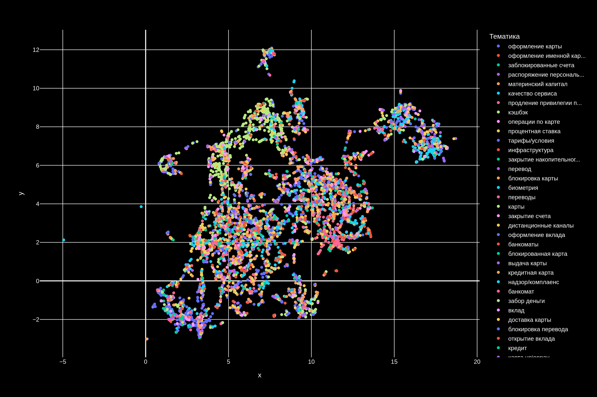
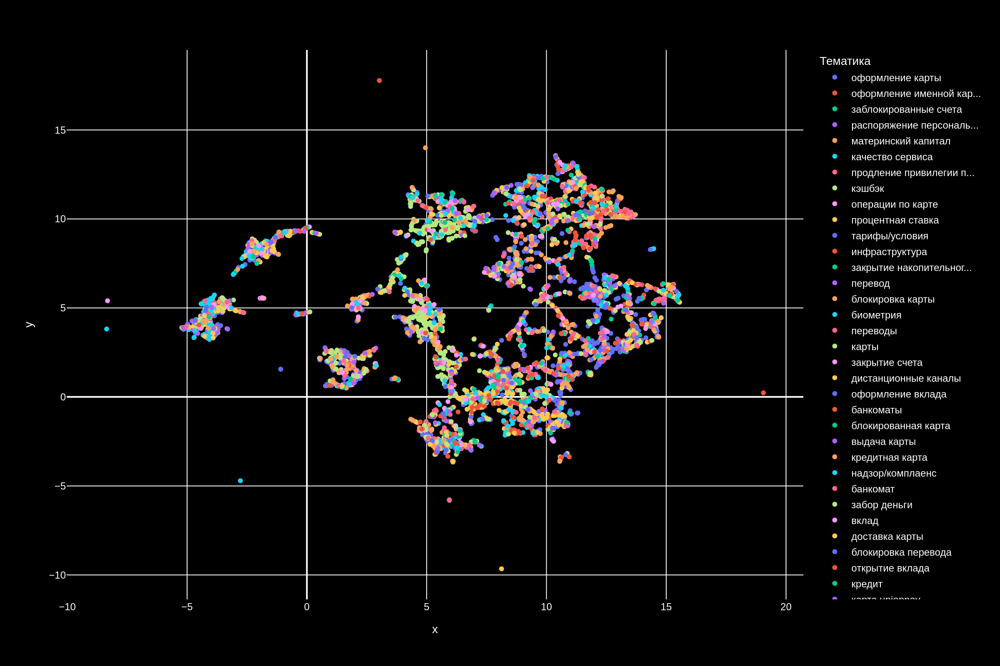
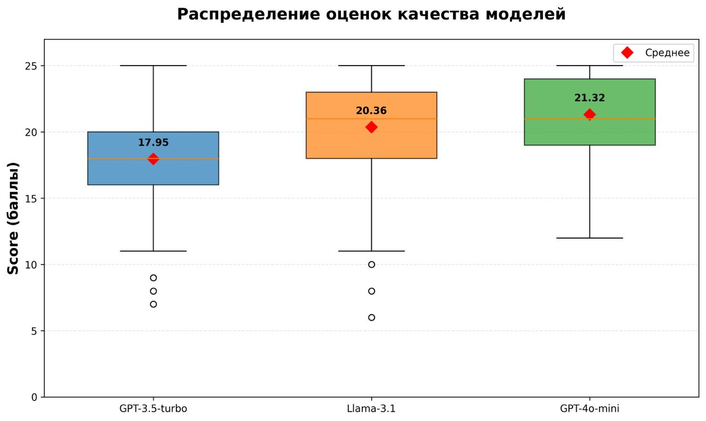

<!--  -->

# 📖 Table of Contents

- [Установка](#установка)
- [Туториалы](#туториалы)
- [llama.cpp](#llamacpp)
- [Датасет](#датасет)
- [Результаты](#результаты)
- [Обучение (lora tuning)](#обучение-lora-tuning)
- [API](#api)

---

## Установка

Перед запуском необходимо собрать фронтенд по адресу [github.com/xpatronum/jaiui](https://github.com/xpatronum/jaiui):

1. `npm ci`
2. `npm run build`
3. Полученные артефакты (js/css/html) положить в папку `jaiai/building`

После этого выполните установку зависимостей:

```bash
git clone https://github/xpatronum/jaiai && cd jaiai
pip install -r requirements.txt
```

Мы протестировали и можем уверенно сказать, что на python >= 3.12 и Ubuntu 22.4 TLS всё будет работать точно.

Запустите докер сервисы (обратите внимание, что наш сервис не обернут в докер):

```bash
docker-compose up -d
```

После этого, убедившись, что все работает, можно запускать:

```bash
uvicorn jaiai.api.run:app --host 0.0.0.0 --port 2288 --workers 4 --proxy-headers
```

---

## Туториалы

- **Кластеризация:** [notebook/note-clustering.ipynb](notebook/note-clustering.ipynb)
- **LLM pipeline:** [notebook/note-llm-calls.ipynb](notebook/note-llm-calls.ipynb)

---

## llama.cpp

Для LLM api подразумевается, что [llama.cpp](https://github.com/ggerganov/llama.cpp) уже запущена и доступна для взаимодействия. Мы использовали формат весов `.gguf`, который можно скачать по <a href="https://disk.yandex.ru/d/CRILMAVVsAK13w">ссылке</a>. Это базовая Llama 3.1 8B, которую мы дообучили на релевантном домене. Подробнее об этом будет далее. 

---

## Датасет

Тестовый датасет расположен прямо в репозитории и содержит 100 реальных отзывов с нашей разметкой. Используйте его для дебага, запуска и отладки.

- `10_000` размеченных примеров. <a href="https://disk.yandex.ru/d/mv-F1Evg-0FwBQ">скачать</a>

**Для получения полных датасетов обращайтесь:**

- Telegram: [@itarlinskiy](https://t.me/itarlinskiy)
- Email: <itarlinskiy@yandex.ru>

---

## Результаты

> Мы попробовали обойти ограничение на то, что у нас нет топиков. Однако, из-за типичности отзывов и необходимости кластеризовать также и тематики, сравнив ДО/После поняли, что тематики важны даже более, чем сами текста отзывов и извлечь эту информацию крайне сложно, используя только ANN кластеризацию.

> Тем не менее, эти подходы не противоречат друг другу, а, наоборот, дополняют. Но всегда есть tradeoff между скоростью и качеством. Ниже представлены сравнения с / без топиков.

> Тематики отсуствуют. Пробуем классифицировать, используя только текста.

> Вместе с текстами подаются на вход и сами тематики.



---

## Обучение (lora tuning)

Для понимания подхода к LoRA рекомендуем ознакомиться с [этой статьей](https://huggingface.co/blog/lora). Мы использовали синтетические данные для дообучения на отзывах, и наши результаты видны ниже (сравнение между gpt-3.5, llama-3.1 8b (наша модель), gpt-4o-mini):




> Для воспроизведения результатов.

- Используйте строго такой же промпт: Лежит `jaiai/builtins/entities_system_prompt.txt`
- Запускать модель только в соответствии со следующими параметрами:<br><b>температура `0.1`</b><br><b>top_p `0.9`</b>

- Веса доступны по <a href="https://disk.yandex.ru/d/CRILMAVVsAK13w">ссылке</a>

- Сам датасет (оценочный) скачать можно <a href="https://disk.yandex.ru/d/Qzyab-wUafhnQw">отсюда</a>
---

## API

> Все схемы входных/выходных данных расположены в `jaiai/etc/schema.py` (pydantic models).

> Все API лежат в jaiai/api/run.py 

- POST `/upload` - вызывается при загрузке файла. Возвращает уникальный `uuid` файла, с которым дальше будет идти взаимодействие
- POST `/predict` - вызывает LLM и выдает топики - тональности
- POST `/is_done` - websocket соединение, которое сообщает статус прогресса кластеризации и выявления топиков - тональностей. ❗️Как только возвращается `100` - вызывается `POST /render`, который выдает основной график с примерами.
- POST `/render` - запрос на отрисовку интерактивного графика
- POST `/ts_render` - запрос на отрисовку временного графика изменения тональностей (доступен только после завершения `is_done`)